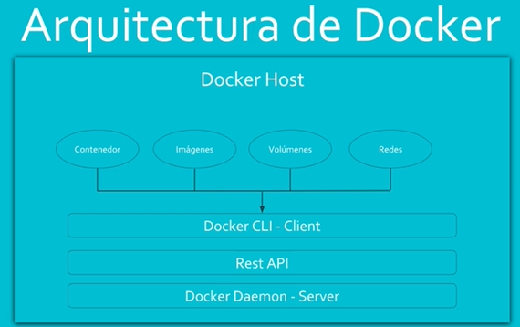
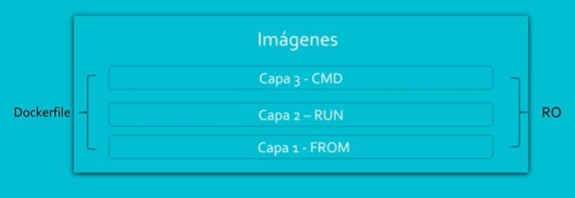
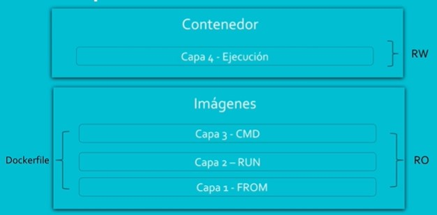

# curso-Docker-de-principiante-a-experto
Curso 'Docker, de principiante a experto' de Udemy https://www.udemy.com/course/docker-de-principiante-a-experto

- - -

## Introducción



### Imagenes

Las imágenes de Docker es un 'paquete' que contiene todo lo necesario para que funcione una aplicación.
Las capas que dispone son:

- **Capa 1 - `FROM`**: Un mini sistema operativo (Debian, Ubuntu...)
- **Capa 2 - `RUN`**: Qué vamos a usar del sistema operativo (Apache, etc...) usando comandos de máquina reales
- **Capa 3 - `CMD`**: Linea que ejecutamos. Esto es lo que va a levantar el servicio



Estas capas son de solo lectura (Read Only - RO), y se definen en el archivo DOCKERFILE. 
Un DOCKERFILE es un archivo de texto plano que define las distintas capas del contenedor

```dockerfile
FROM centos:7						Instala centos7
RUN  yum -y install httpd			Instala apache
CMD	["apachedtl","-DFOREGROUND"]	Arranca apache en primer plano
```

Es muy importante que el servicio que arranque se quede en primer plano.

### Contenedores

Un contenedor es una capa adicional que trae una ejecución en tiempo real de las capas de la imagen



Mientras el CMD funcione, el contenedor va a funcionar. 
La diferencia es que esta nueva capa SÍ es de escritura (RW).
No obstante todos los cambios que vamos a hacer sobre la capa 4 son volátiles, por lo que las configuraciones
deberán realizarse en las imagenes (capas 1,2,3)

Un contenedor dispone: 
- De las capas inferiores de las **imagenes**
- **Volúmenes** que permiten establecer persistencia y guardar datos
- **Redes** para lograr comunicar contenedores entre sí


## Instalacion

Instalar Docker: `Config file `/lib/systemd/system/docker.service`

<details><summary>how</summary>
<p>

```bash
# Instalar Docker

Config file /lib/systemd/system/docker.service

# CentOS
---------

    # Utilidades
    sudo yum install -y yum-utils device-mapper-persistent-data lvm2

    # Agregar el repo de docker
    sudo yum-config-manager --add-repo https://download.docker.com/linux/centos/docker-ce.repo

    # Instalar docker
    sudo yum install docker-ce -y
    # Iniciar el servicio

    sudo systemctl start docker
    # Iniciarlo con el sistema

    sudo systemctl enable docker
    # Agregar usuario al grupo docker 

    whoami # Saber el nombre de tu usuario
    sudo usermod -aG docker nombre_de_salida_en_whoami

    # Salir de la sesión
    exit

    # Iniciar de nuevo con el usuario y probar 
    docker run hello-world

# Fedora 
---------

# La instalación es igual que en CentOS, solo deben modificar la url del repo, porque los pasos son idénticos

    # Utilidades
    sudo yum install -y yum-utils device-mapper-persistent-data lvm2

    # Agregar el repo de docker
    sudo yum-config-manager --add-repo https://download.docker.com/linux/fedora/docker-ce.repo

    # Instalar docker
    sudo yum install docker-ce -y

    # Iniciarlo con el sistema
    sudo systemctl enable docker

    # Agregar usuario al grupo docker 
    whoami # Saber el nombre de tu usuario
    sudo usermod -aG docker nombre_de_salida_en_whoami

    # Salir de la sesión
    exit

    # Iniciar de nuevo con el usuario y probar 
    docker run hello-world

# Ubuntu
---------

    # Actualiza los repos
    sudo apt-get update

    # Instala utilidades
    sudo apt-get install apt-transport-https ca-certificates curl software-properties-common -y

    # Agregar el gpg 
    curl -fsSL https://download.docker.com/linux/ubuntu/gpg | sudo apt-key add -

    # Agregar el repo
    sudo add-apt-repository "deb [arch=amd64] https://download.docker.com/linux/ubuntu $(lsb_release -cs) stable"

    # Actualizar de nuevo
    sudo apt-get update

    # Instalar docker
    sudo apt-get install docker-ce

    # Iniciarlo con el sistema
    sudo systemctl enable docker

    # Agregar usuario al grupo docker 
    whoami # Saber el nombre de tu usuario
    sudo usermod -aG docker nombre_de_salida_en_whoami

    # Salir de la sesión
    exit

    # Iniciar de nuevo con el usuario y probar 
    docker run hello-world


# Debian
---------

    # Actualiza los repos
    sudo apt-get update

    # Instala utilidades
    sudo apt-get install apt-transport-https ca-certificates curl gnupg2 software-properties-common -y

    # Agregar el gpg 
    curl -fsSL https://download.docker.com/linux/debian/gpg | sudo apt-key add -

    # Agregar el repo
    sudo add-apt-repository "deb [arch=amd64] https://download.docker.com/linux/debian $(lsb_release -cs) stable"

    # Actualizar de nuevo
    sudo apt-get update

    # Instalar docker
    sudo apt-get install docker-ce

    # Iniciarlo con el sistema
    sudo systemctl enable docker

    # Agregar usuario al grupo docker 
    whoami 
    
    # Saber el nombre de tu usuario
    sudo usermod -aG docker nombre_de_salida_en_whoami

    # Salir de la sesión
    exit

    # Iniciar de nuevo con el usuario y probar 
    docker run hello-world

```

</p>
</details>

## Comandos básicos de docker

<details>
<p>

```bash
Options:
      --config string      Location of client config files (default "/home/dreamgenics/.docker")
  -c, --context string     Name of the context to use to connect to the daemon (overrides DOCKER_HOST env var and default
                           context set with "docker context use")
  -D, --debug              Enable debug mode
  -H, --host list          Daemon socket(s) to connect to
  -l, --log-level string   Set the logging level ("debug"|"info"|"warn"|"error"|"fatal") (default "info")
      --tls                Use TLS; implied by --tlsverify
      --tlscacert string   Trust certs signed only by this CA (default "/home/dreamgenics/.docker/ca.pem")
      --tlscert string     Path to TLS certificate file (default "/home/dreamgenics/.docker/cert.pem")
      --tlskey string      Path to TLS key file (default "/home/dreamgenics/.docker/key.pem")
      --tlsverify          Use TLS and verify the remote
  -v, --version            Print version information and quit

Management Commands:
  builder     Manage builds
  config      Manage Docker configs
  container   Manage containers
  context     Manage contexts
  engine      Manage the docker engine
  image       Manage images
  network     Manage networks
  node        Manage Swarm nodes
  plugin      Manage plugins
  secret      Manage Docker secrets
  service     Manage services
  stack       Manage Docker stacks
  swarm       Manage Swarm
  system      Manage Docker
  trust       Manage trust on Docker images
  volume      Manage volumes

Commands:
  attach      Attach local standard input, output, and error streams to a running container
  build       Build an image from a Dockerfile
  commit      Create a new image from a container's changes
  cp          Copy files/folders between a container and the local filesystem
  create      Create a new container
  diff        Inspect changes to files or directories on a container's filesystem
  events      Get real time events from the server
  exec        Run a command in a running container
  export      Export a container's filesystem as a tar archive
  history     Show the history of an image
  images      List images
  import      Import the contents from a tarball to create a filesystem image
  info        Display system-wide information
  inspect     Return low-level information on Docker objects
  kill        Kill one or more running containers
  load        Load an image from a tar archive or STDIN
  login       Log in to a Docker registry
  logout      Log out from a Docker registry
  logs        Fetch the logs of a container
  pause       Pause all processes within one or more containers
  port        List port mappings or a specific mapping for the container
  ps          List containers
  pull        Pull an image or a repository from a registry
  push        Push an image or a repository to a registry
  rename      Rename a container
  restart     Restart one or more containers
  rm          Remove one or more containers
  rmi         Remove one or more images
  run         Run a command in a new container
  save        Save one or more images to a tar archive (streamed to STDOUT by default)
  search      Search the Docker Hub for images
  start       Start one or more stopped containers
  stats       Display a live stream of container(s) resource usage statistics
  stop        Stop one or more running containers
  tag         Create a tag TARGET_IMAGE that refers to SOURCE_IMAGE
  top         Display the running processes of a container
  unpause     Unpause all processes within one or more containers
  update      Update configuration of one or more containers
  version     Show the Docker version information
  wait        Block until one or more containers stop, then print their exit codes
```

</p>
</details>

## Imágenes 

### Imágenes oficiales

Las imágenes oficiales se alojan en https://hub.docker.com. Dentro de la web se disponen de versiones de las imagenes creadas por sus autores. 

Para descargar las imagenes usaremos la orden: `docker pull 'nombre'`, que descargará un tag (version) de la imagen. En caso de no indicar el tag, se descargará la última (lastest). En caso de indicar la versión que queremos, se descargará esa:

Comandos básicos:
- Descarga versión lastest: `docker pull 'nombre'`
- Descarga versión concreta: `docker pull 'nombre':version`
- Ver versiones instaladas de 'imagen': `docker images | grep 'imagen'`

Ejemplo de salida:
```bash
dreamgenics@debian:~$ docker pull mysql
Using default tag: latest
latest: Pulling from library/mysql
852e50cd189d: Pull complete 
29969ddb0ffb: Pull complete 
...
Digest: sha256:4bb2e81a40e9d0d59bd8e3dc2ba5e1f2197696f6de39a91e90798dd27299b093
Status: Downloaded newer image for mysql:latest
docker.io/library/mysql:latest
```

Las imágenes poseen una serie de capas que pueden ser compartidas por varias imágenes. Si al descargar una nueva versión se observa que se dispone una capa de las imágenes, docker indicará que ya existe, por lo que no se tocan.

En caso de que dispongamos una imagen en su estado latest y esta cambie en el hub, al descargar la nueva version latest, la antigua no se elimina, sino que su tag cambiará  a `<none>`, dado que no puede haber imágenes con un mismo tag. 

### Imágenes propias

Cuando queremos generar imágenes personalizadas, podemos configurar nuestras propias imagenes.
Para ello:

- Iremos al directorio `~/docker-images`
- Crearemos un nuevo archivo `DOCKERFILE`
- Lo editaremos, creando un dockerfile como de otro sistema. Por ejemplo vamos a instalar un centOS con php:
  - Capa 1 FROM: `FROM centos` > capa base de centos
  - Capa 2 RUN: `RUN yum install httpd -y` > capa apache php indicando 'yes' a todas las preguntas

El archivo quedaria asi:
```
FROM centos
RUN yum install httpd -y
```

Con `docker build` podemos construir una imagen a partir de un dockerfile. Se indica el nombre de la imagen resultate y la ruta del dockerfile con el que crear la imagen `docker build --tag <nombreimagenresultante>:<tag> <ruta_dockerfile>`. 

En nuestro ejemplo, como estamos en el mismo directorio del dockerfile:
- `docker build --tag centOsPhp .` (al no incluir el nombre del tag lo creara como latest)

Una vez creada podemos verla dentro de nuestras imagenes:
```bash
dreamgenics@debian:~/dev/docker$ docker image ls
REPOSITORY          TAG                 IMAGE ID            CREATED             SIZE
centosphp           latest              6a820eb615fa        46 seconds ago      254MB   <--
mysql               latest              dd7265748b5d        2 days ago          545MB
centos              latest              0d120b6ccaa8        3 months ago        215MB
...
```

#### Contenedores básicos: correr imagen propia

Ahora podemos correr esta nueva imagen sobre un contenedor, creandolo a partir de la propia imagen.
Para ello incluiremos la capa CMD en nuestro dockerfile, ya que usará dicho dockerfile para arrancar el contenedor:

Segun internet, para correr apache en primer plano debemos usar `apachectl -FOREGROUND` asi que lo incluimos en el archivo:

```
FROM centos
RUN yum install httpd -y
CMD apachectl -FOREGROUND
```

Deberemos crear una nueva imagen a partir de este dockerfile ya que sino usa la anterior, que no dispone de la orden CMD. La creamos usando la orden del apartado anterior machacando el tag existente `docker build --tag centOsPhp .`

Si ahora visualizamos la historia de la imagen vemos que salen los cambios realizados:

- `docker history -H centosphp`
```bash
dreamgenics@debian:~/dev/docker$ docker history -H centosphp
IMAGE               CREATED              CREATED BY                                      SIZE  
33a19c9a2c35        About a minute ago   /bin/sh -c #(nop)  CMD ["/bin/sh" "-c" "apac…   0B   
6a820eb615fa        9 minutes ago        /bin/sh -c yum install httpd -y                 39.3MB
0d120b6ccaa8        3 months ago         /bin/sh -c #(nop)  CMD ["/bin/bash"]            0B
<missing>           3 months ago         /bin/sh -c #(nop)  LABEL org.label-schema.sc…   0B
<missing>           3 months ago         /bin/sh -c #(nop) ADD file:538afc0c5c964ce0d…   215MB     
```

Si ahora queremos arrancar un contenedor con la imagen usaremos: `docker run -d --name <nombrecontendor> -p PORT_SALIDA:PORT_CONTAINER <nombreimagen>:<tagimagen>`, con nuestra imagen seria `docker run -d --name contenedorcentosapache -p 80:80 centosphp`, con lo que podemos acceder al puerto 80 del container usando el puerto 80 de nuestro localhost:

- `docker run -d --name contenedorcentosapache -p 80:80 centosphp`
```bash
dreamgenics@debian:~/dev/docker$ docker run -d --name contenedorcentosapachephp centosphp
f35b1b70ff8333ce074b4c684a8d639f8688901b377f6ee9a93134718f4dc412
dreamgenics@debian:~/dev/docker$ docker ps 
CONTAINER ID        IMAGE               COMMAND                  CREATED             STATUS              PORTS               NAMES
f35b1b70ff83        centosphp           "/bin/sh -c 'apachec…"   10 seconds ago      Up 8 seconds                            contenedorcentosapachephp
```

Si ahora vamos al puerto 80 del localhost vemos que está corriendo el apache

### Dockerfile
Ver https://docs.docker.com/engine/reference/builder/

El dockerfile será el archivo de configuración de las imagenes docker. Crea las capas de la imagen indicando desde el sistema operativo base hasta aplicaciones complejas. Dis

- `FROM`: Indica la **imagen o el sistema operativo desde el que se crea la imagen**
- `RUN`: Permite ejecutar **órdenes de configuración** como instalar paquetes
- `CMD`: **Ejecuta ordenes como levantar servicios**, etc...
- `COPY`: Permite **copiar archivos y carpetas a la imagen**. Se debe indicar qué queremos copiar (tomando como referencia la carpeta donde está el dockerfile) y el destino dentro de la imagen. Por ejemplo, si queremos copiar la carpeta 'carpeta_copia' que está en el mismo directorio a la carpeta `/var/www/html` de la imagen, el dockerfile seria `COPY carpeta_copia /var/www/html`
- `ADD`: Hace lo mismo que COPY, aunque esto permite incluir una URL como fuente, permitiendo descargar el archivo a la carpeta. Se prefiere usar COPY excepto cuando el origen es una URL.
- `ENV`: Permite **configurar variables de entorno**. Su sintaxis seria `ENV <nombreVariable> <valorVariable>`. Por ejemplo, una variable `ENV contenido prueba`. Si después queremos ver el valor de la variable, podemos ejecutar un nuevo `RUN` mostrando su valor con `RUN echo "$contenido"`
- `WORKDIR`: Sirve para **situar el directorio actual**. Por ejemplo, si indicamos `WORKDIR /var/www/html`, a partir de ese punto nos encontraremos en ese directorio.
- `EXPOSE`: Permite **exponer puertos** de la imagen
- `LABEL`: Es una **etiqueta**. Puede ir en cualquier lugar del dockerfile. Si el texto lleva espacios deberia estar entre comillas. Hay que tener en cuenta que segun donde lo pongamos forzará la recosntrucción de la imagen, ya que si está por ejemplo por debajo de la creación del apache, entenderá que ha cambiado lo que está por debajo del apache
- `USER`: Permite definir **que usuario** realiza la acción. Este usuario deberá existir (podemos incluirlo con un `RUN useradd <nombreUser>`). Ojo porque seguramente deberemos definir permisos sobre archivos o carpetas según lo que necesitemos realizar.
- `VOLUME`: Permite disponer de contenido **persistente** en el contenedor. Para ello deberemos definir qué ruta queremos que sea persistente. Por ejemplo, si queremos que el directorio `/var/www/html` sea persistente deberemos incluir `VOLUME /var/www/html`
- `CMD`: Se utiliza para "mantener vivo al contenedor", **ejecutando procesos o scripts** que deberían estar en primer plano. Si por ejemplo en lugar de indicar directamente la ejecución de un servicio, creamos un script como este llamado `run.sh`:
  ```bash
  #!/bin/bash
  echo "Iniciando container..."
  apachectl -DFOREGROUND
  ```
  Lo que haremos será copiarlo con `COPY` y despues ejecutarlo (por ejemplo `CMD sh ./run.sh`)
- `.dockerignore`: Es un archivo normalmente oculto. Permite ignorar archivos o carpetas al construir una imagen. Se crea en el mismo directorio del dockerfile, ya que todo lo que esté en la carpeta del dockerfile se enviará al construir la imagen.

Aplicandolo a nuestro anterior ejemplo usando COPY en lugar de ADD:

`dockerfile`
```dockerfile
FROM        centos
LABEL       version=1.0
LABEL       description="this is an apache image"
LABEL       vendor=jrg
RUN         yum install httpd -y
WORKDIR     /var/www/html
COPY        carpeta_copia .
ENV         contenido prueba
RUN         echo "$contenido"
RUN         useradd javier
USER        javier
VOLUME      /var/www/html
EXPOSE      8080
CMD         apachectl -FOREGROUND
``` 

Otro ejemplo de un dockerfile completo:
```dockerfile
FROM nginx                          instala imagen oficial de ngnix
RUN useradd ricardo                 incluye el usuario ricardo
COPY fruit /user/share/ngin/html    copia el archivo fruit al directorio
ENV  archivo docker                 crea la variable de entorno 'archivo' con valor 'docker'
WORKDIR /usr/share/ngnix/html       situa el directorio de trabajo al /usr/share/ngnix/html
EXPOSE 90                           expone el puerto 90
LABEL version=1                     añade el comentario
RUN echo "Soy $(whoami)"            ejecuta la orden echo "Soy $(whoami)"
USER root                           cambia el usuario a root
VOLUME /var/log/nginx               crea la unidad persistente 
CMD ngnix -g 'daemon off:'          ejecuta el demonio de ngnix
```

### Eliminar imagenes

Podemos eliminar imagenes con `docker rmi`:
- `docker rmi <image1>:<tag> <image2>:<tag>`

Para ver images: `docker images`. Podemos filtrar con `docker images | grep <nombre>` o `docker images -f <atributo>` para filtrar por atributos (por ejemplo, imagenes huérfanas: `docker images -f dangling=true`)

### Cambiar nombre a dockerfile

Si queremos crear una imagen usando un archivo dockerfile con otro nombre que no sea 'dockerfile' , podemos hacerlo con el parametro `-f <nombre dockerfile>`

Por ejemplo, para construir la imagen `test` con un dockerfile llamado `dockerfile-test` usaremos la orden `docker build -t test -f dockerfile-test .`

### Dangling images

A veces tenemos imagenes sin nombre ni tag, mostrando `<none>` en ambos casos. Esto es una dangling image (imagen huérfanas o sin referenciar). 

Cuando creamos una imagen podemos sobreescribir una imagen anterior con el mismo nombre y tag. Esto hace que la imagen anterior pierda su nombre y tag al ser sustituida por la nueva. Esto se debe a que ciertas capas de las imagenes son de solo lectura, por lo que no podemos modificarlas.

Para acabar con este problema podemos definir tags al crear las capas, de forma que crearemos nuevas imagenes con tags distintos.

Para eliminar imagenes huérfanas, podemos filtrarlas por `docker images -f dangling=true`. Para borrarlas podemos borrarlas con el id `docker rmi <id>`, o podemos usar `docker images -f dangling=true -q | xargs docker rmi` (filtramos con `-f`, mostramos solo los ids con `-q` y con `| xargs docker rmi`, pasamos la lista que devuelve `-q` como input a la orden `docker rmi` (esto se hace con `| xargs`))

### Buenas prácticas

- La imagen o el servicio que se instala debe ser **efímero**, debe poder destruirse con facilidad
- **Un servicio por contenedor**. La idea es que el CMD solo corra un servicio para garantizar el aislamiento y la escalabilidad
- Si no necesitamos archivos pesados, al construir la imagen usar el **.dockerfile** para mantener las imágenes pequeñas
- Usar **pocas capas**, minimizar las capas de la imagen: Encadenar ordenes con && para tener varios argumentos en una capa. Por ejemplo:
  ```dockerfile
  RUN echo "1" >> /usr/share/html.txt
  RUN echo "1" >> /usr/share/html.txt
  ```
  puedes sustituirse por:
  ```dockerfile
  RUN echo "1" >> /usr/share/html.txt && echo "1" >> /usr/share/html.txt
  ``` 
- Separar **argumentos largos** en **varias lineas** usando \: El ejemplo anterior:
  ```dockerfile
  RUN \
    echo "1" >> /usr/share/html.txt && \
    echo "2" >> /usr/share/html.txt
  ``` 
- **No** instalar paquetes **innecesarios**
- Usar **labels** para añadir metainformación a la imagen (versiones, etc...)

### Ejemplo de imagen: Imagen con Apache + Php + TSL/SSL

- Necesitaremos un certificado autofirmado. Lo crearemos con `openssl req -x509 -nodes -days 365 -newkey rsa:2048 -keyout docker.key -out docker.crt`. En Common Name incluiremos 'localhost' para que el certificado sea para ese sitio 
- Esto crea los certificados `docker.crt` y `docker.key` para el certificado autofirmado SSL que deberemos copiar en la imagen. La situamos en el mismo directorio que el `dockerfile` que crearemos
- Necesitaremos instalar las dependencias: `httpd` (apache), `php-cli php-common` (php), `mod_ssl open_ssl` (SSL). Automaticamente docker instalara el resto de dependencias.
- Seguiremos el tutorial de https://www.digicert.com/kb/ssl-support/apache-multiple-ssl-certificates-using-sni.htm. Nos indica que debemos modificar la configuracion de vhost de apache incluyendo en el archivo `ssl.conf`:
  ```xml
  <VirtualHost *:443>
  ServerName www.yoursite.com
  DocumentRoot /var/www/site
  SSLEngine on
  SSLCertificateFile /docker.crt  <-- incluimos nuestro crt
  SSLCertificateKeyFile /docker.key <-- incluirmos nuestro key
  SSLCertificateChainFile /path/to/DigiCertCA.crt
  </VirtualHost>
  ```
  Crearemos el archivo `ssl.conf` que define la configuracion anterior. 
  Esto debe ir dentro de una ruta de apache `/etc/http/conf.d/default.conf` que es donde se define la configuración de SSL.
  En el documento definimos el puerto 443 como punto de entrada SSL, por lo que deberemos exponer el puerto 443
- Creamos el dockerfile: 
  ```dockerfile
  FROM centos:7
  # Instala apache, php y las dependencias para ssl
  RUN \
    yum -y install \
    httpd \
    php-cli php-common \
    mod_ssl open_ssl
  RUN echo "<?php phpinfo(); ?>" > /var/www/html/hola.php # Capa para probar si funciona php 
  COPY ssl.conf /etc/http/conf.d/default.conf
  COPY docker.crt /docker.crt
  COPY docker.key /docker.key
  EXPOSE 443
  CMD apachectl -DFOREGROUND
  ```
- Construimos el `.dockerignore` incluyendo los archivos del mismo directorio del dockerfile que no queremos que estén en la imagen 
- Construimos la imagen taggeada como `ssl-ok`: `docker build -t apache:ssl-ok .`
- Corremos el contenedor con la imagen exponiendo el puerto 443 para obligar a usar ssl: `docker run -d -p 443:443 apache:ssl-ok`
- Vemos si está corriendo: `docker ps`
- Navegamos a `localhost:80\hola.php` y comprobamos si está activado php (deberia aparecer el info de php)

### Ejemplo de imagen: Nginx y PHP-FPM

Un ejemplo de dockerfile con Nginx y PHP-FPM seria: 

```dockerfile
FROM centos:7
COPY ./conf/nginx.repo /etc/yum.repos.d/nginx.repo
RUN                                                                          \
  yum -y install nginx --enablerepo=nginx                                 && \
  yum -y install  https://repo.ius.io/ius-release-el7.rpm                 && \
  yum -y install                                                             \
    php71u-fpm                                                               \
    php71u-cli                                                               \
    php71u-mysqlnd                                                           \
    php71u-soap                                                              \
    php71u-xml                                                               \
    php71u-zip                                                               \
    php71u-json                                                              \
    php71u-mcrypt                                                            \
    php71u-mbstring                                                          \
    php71u-zip                                                               \
    php71u-gd                                                                \
    --enablerepo=ius-archive && yum clean all

EXPOSE 80 443
VOLUME /var/www/html /var/log/nginx /var/log/php-fpm /var/lib/php-fpm
COPY ./conf/nginx.conf /etc/nginx/conf.d/default.conf
COPY ./bin/start.sh /start.sh
COPY index.php /var/www/html/index.php
RUN chmod +x /start.sh
CMD /start.sh
```

### Multi-Stage build - imagenes con maven, java y similares

Desde las ultimas versiones, podemos usar varios FROM desde el mismo dockerfile, por ejemplo compilar un java y usar maven. El último FROM será el que se tenga en cuenta finalmente para construir la imagen.

Por ejemplo, una imagen que tenga un maven para construir un jar:

`dockerfile`:
```dockerfile
# 1 Maven crea el jar inicial
FROM maven:3.5-alpine as builder
COPY app /app
RUN  cd /app && mvn package
# 2 Java que ejecuta el jar `my-app-1.0-SNAPSHOT.jar` creado antes
FROM openjdk:8-alpine
COPY --from=builder /app/target/my-app-1.0-SNAPSHOT.jar /opt/app.jar
CMD  java -jar /opt/app.jar
```

En este caso, la imagen resultante elimina las dependencias que necesita maven para crear el jar, ya que usa solo la ultima parte (el segundo FROM) para construir la imagen final. Docker asume que los pasos anteriores son temporales.

Para entender esto podemos usar el comando `fallocate` que crea un archivo de texto con un peso especificado por el usuario

```dockerfile
# Creamos la imagen con centos y le añadimos los archivos de 10, 20 y 30 megas
FROM centos as test
RUN fallocate -l 10M /opt/file1
RUN fallocate -l 20M /opt/test2
RUN fallocate -l 30M /opt/test3
# Aqui pesaria unos 230 megas. Gracias al multi-stage build, el nuevo FROM hace que iniciemos 
# desde alpine, que pesa unos 20 megas en total
FROM alpine
COPY --from=test /opt/test2 /opt/myfile
```

Si vemos el peso definitivo de la imagen que crea este dockerfile, vemos que corresponde al de la imagen alpine y el archivo test2, sin el peso de centos y los 3 archivos creados.

## Contenedores

- Los contenedores son instancias de ejecución de imágenes. Los contenedores ejecutan las imágenes, pudiendo crear distintos contenedores basandonos en una sola imagen.
- Son temporales, por lo que nunca deberiamos hacer cambios en los contenedores.
- No obstante, aunque las capas de las imagenes son de solo lectura, los contenedores son capas de lectura-escritura. 

### Comandos básicos sobre contenedores

- **Listado**:
  - Listar contenedores en ejecucion: `docker ps`
  - Listar todos los contenedores (activos y detenidos): `docker ps -a`
  - Listar ids de los contenedores: `docker ps -q`
- **Correr contenedores**:
  - Correr contenedor en segundo plano (`-d`) a partir de imagen: `docker run -d <imagen>`
  - Correr contenedor seteando nombre (`--name`): `docker run -d --name <nombre> <imagen>`
  - Correr contenedor con mapeo de puertos (`-p`) : `docker run -d -p <puertoHost>:<puertoContenedor> <imagen>`
  - Correr contenedor con una imagen de un SO (`-dti`): `docker run -dti <imagen>`
- **Arrancar/cerrar contenedores**
  - Arrancar contenedor: `docker start <nombreContenedor>` / `docker start <idContenedor>`
  - Detener contenedor: `docker stop <nombreContenedor>` / `docker stop <idContenedor>`
  - Reiniciar contenedor: `docker restart <nombreContenedor>` / `docker restart <idContenedor>`
- **Borrado / renombrado de contenedores**:
  - Borrar un contenedor forzando (`-f`) por nombre: `docker rm -f <nombrecontenedor1> <nombrecontenedor2>` 
  - Borrar todos los contenedores: `docker ps -q | xargs docker rm -f`  
  - Reemplazar nombre a contenedor: `docker rename <nombreAntiguo> <nuevoNombre>`
- **Ingresar dentro de contenedores**:
  - Ejecutar algo dentro del contenedor: `docker exec -ti <nombreContenedor> <tipoTerminal>`. Esto abre una terminal dentro del contenedor (`-ti` terminal interactivo / `<tipoTerminal>` tipo de terminal. Puede ser `bash` o `sh`))
  - Ejecutar algo como root dentro del contenedor: `docker exec -u root -ti <nombreContenedor> <tipoTerminal>`. Esto abre una terminal dentro del contenedor con el usuario root (`-u` user)
  - Ejecutar algo como otro usuario dentro del contenedor: `docker exec -u <nombreUsuario> -ti <nombreContenedor> <tipoTerminal>`. Esto abre una terminal dentro del contenedor con el usuario indicado (`-u` user). Deberá existir el usuario, indicándolo en el dockerfile. En caso de no indicar el usuario, se ingresará con el último usuario definido en el dockerfile mediante un `USER`, y si no se ha seleccionado ningún usuario en el dockerfile, nos loguearemos con root. 
- **Variables de entorno**:
  - Setear variable de entorno en tiempo de ejecución del contenedor: Aparte de la creacion en el dockerfile, podemos crear una variable de entorno dentro de un contenedor al correrlo con `-e -e "nombreVariable=valorVariable"`: `docker run -d -e "nombreVariable=valorVariable"`
- **Recursos**:
  - Ver recursos del contenedor: `docker stats <nombreContenedor>`
  - Limitar memoria RAM (`-m`) (por ejemplo 500mb): `docker run -d -m "500mb" --name <nombreContenedor> <nombreImagen>`
  - Limitar numero de cpus: `docker run -d --cpuset-cpus <numeroCpus> --name <nombreContenedor> <nombeImagen>` 
- **Copiar archivos dentro del contenedor**:
  - Copiar un archivo dentro de un contenedor: `docker cp <rutaArchivoACopiar> <nombreContenedor>:<directorioDestino>`
  - Copiar archivo desde un contenedor: `docker cp <nombreContenedor>:<rutaDelArchivo> <rutaDestinoEnHost>`
- **Construir imagen a partir de un contenedor**
  - Usaremos `docker commit` para hacer una imagen a partir de un estado de un contenedor, por ejemplo  para guardar si se ha creado alguna configuracion o se ha copiado algun archivo. Ojo: Solo se guardarán archivos que estén **FUERA** de los volúmenes que hemos definido en el dockerfile: `docker commit <contenedor> <nombreImagenResultante>`. 
- **Sobreescribir CMD del dockerfile**:
  - Si al arrancar el contenedor con `docker run`, sobreescribiremos la orden `CMD` definida en el dockerfile: `docker run -d <nombreImage> <nuevaOrdenCMD>` - *Ejemplo*: `docker run -dti centos echo hola mundo`
- **Contenedor autodestruible**:
  - Docker tiene una opcion `--rm` que indica que el contenedor debe autodestruirse cuando salgamos de la sesion. Deberemos quitar el parametro `-d` ya que no debe correr en el fondo. Lo que hacemos es que al arrancar el contenedor entramos en su bash (quitando el -d) y al salir se autodestruya
- **Cambiar documentRoot**
  - Si queremos ver el documentRoot del usuario `root` (con `docker info | grep -i root`), nos devolverá el directorio de trabajo por defecto del usuario root. Para cambiarlo a otra ubicación 
    - Cambiamos el archivo de configuración de `/lib/systemd/system/docker.service`, modificando la linea `ExecStart=/usr/bin/dockerd` incluyendo `--data-root <rutaNueva>`
    - Hacemos que el daemon de `daemon-loader` lea los cambios con `systemctl daemon-reload`
    - Reiniciamos el servicio con `systemctl restart docker`
    - Movemos la carpeta `docker/` a la nueva ruta de la carpeta
    - Volvemos a leer los cambios del `daemon-loader` y del servicio de docker `systemctl restart docker`

## Volúmenes

Son una herramienta que permiten guardar datos de forma persistente. Tenemos tres tipos de volúmenes:
- **Host**: Volúmenes que se almacenan en el docker host, en el propio sistema del host
- **Anonymous**: No definimos una carpeta pero docker crea una random
- **Named Volumes**: Carpetas con nombre definido, manejadas por Docker

